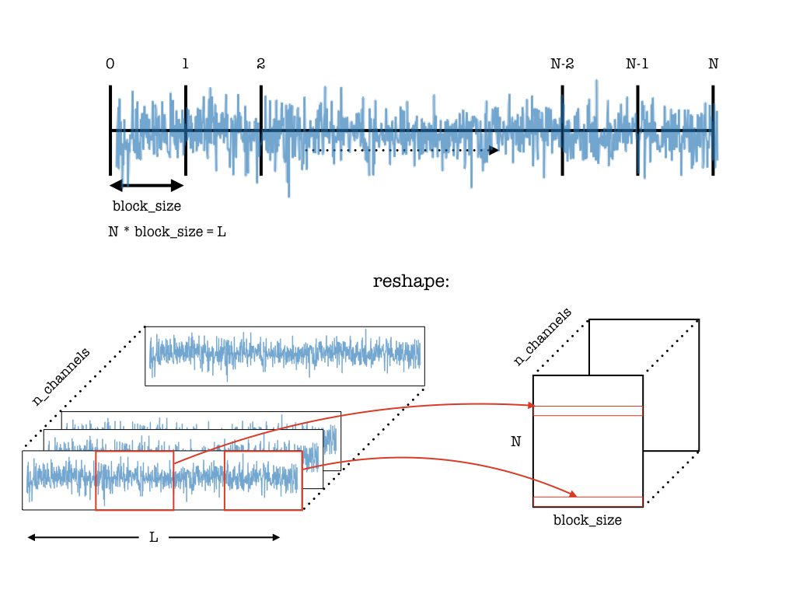
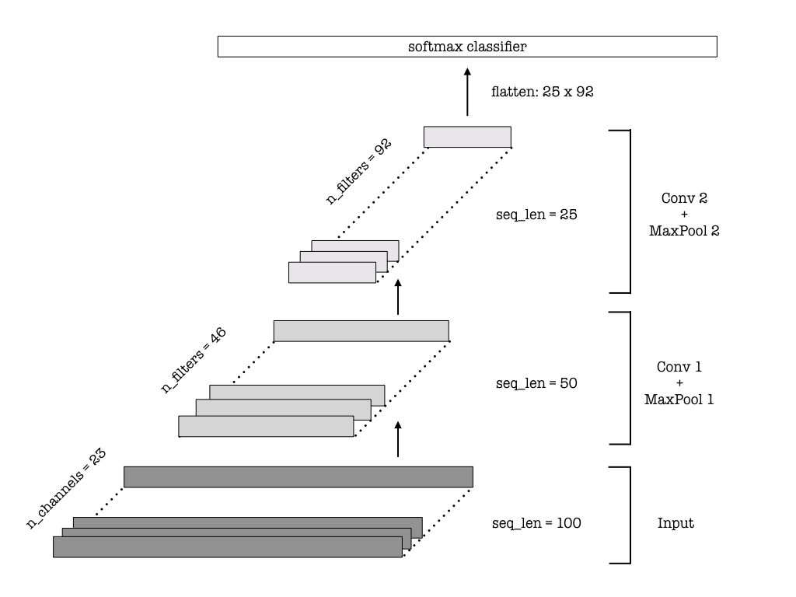
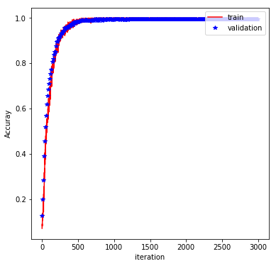

# Using Deep Learning for Mobile Health Data

## Background
The widespread use and popularity of wearable electronics offer a large variety of applications in the healthcare arena. With contionous monitoring of body activity and vital signs, wearables could possibly be life saving.
One could think of numerous applications including, but not limited to predicting oncoming seizures using a wearable electroencephalogram (EEG) device, and [detecting atrial fibrilation](http://www.mobihealthnews.com/content/study-apple-watch-paired-deep-neural-network-detects-atrial-fibrillation-97-percent-accuracy) with a wearable electrocardiography (ECG) device. 
These types of applications would significantly improve patients' lives and open up possibilities for alternative treatments. 

In this tutorial, I will consider an example dataset which is based on body motion and vital signs recordings and implement a deep learning architecture to perform a classification task. 
The data I use for this tutorial is the [MHEALTH](https://archive.ics.uci.edu/ml/datasets/MHEALTH+Dataset) dataset, which can be downloaded from the UCI Machine Learning Repository. The techniques discussed in this post serve as an example for various applications that can arise in classifying time-series data. 

The code used for this post can be accessed from my [repository](https://github.com/bhimmetoglu/datasciencecom-mhealth). The repository contains various utilities (`utils.py`) that process the data as well as a Python notebook that performs the training of the neural network. 

## Data Preprocessing
As decribed in the original [repository](https://archive.ics.uci.edu/ml/datasets/MHEALTH+Dataset), the data is obtained from the body movements and vital signs recordings of ten volunteers. Mesurements were performed by using sensors placed on subjects' ankles, arms and chests. 23 different types of signals were recoreded which I will refer to as `channels` for the rest of this post. Most of these channels are related to body motion, except two of which are electrodiagram signals from the chest. The 10 sujects have performed 12 different types of activities during the eperiments. These activities are

1. Standing still 
2. Sitting and relaxing 
3. Lying down 
4. Walking 
5. Climbing stairs 
6. Waist bends forward 
7. Frontal elevation of arms
8. Knees bending (crouching) 
9. Cycling 
10. Jogging 
11. Running  
12. Jump front & back 

The task here is to correctly predict the type of activity based on the 23 channels of recordings. 

Once the data is loaded (the dowload and extraction of the zip archives can be performed with the `download_and_extract` function in `utils.py`), one obtains the recoding logs for the 10 subjects. Each log file contains 23 columns for each channel, and 1 column for the class (one of 12 activities). There are about 100,000 rows (on average) for each subject. Each row corresponds to a data point recorded at a sampling rate of 50 Hz (i.e. 50 samples per second), therefore the time difference between each row is 0.02 seconds. 
The number of data points for each activity is 


| Activity      | Number of instances |   
|---------------|---------------------|
| 1             | 3072                |
| 2             | 3072                |
| 3             | 3072                |
| 4             | 3072                |
| 5             | 3072                |
| 6             | 3072                |
| 7             | 3072                |
| 8             | 3379                |
| 9             | 3072                |
| 10            | 3072                |
| 11            | 3072                |
| 12            | 1075                |

Except for the 12th activity (Jump front & back), all others have about 3000 data instances.  

### Division into blocks

To classiy the data correctly, the algorithm used should be able to identify patterns in the time-series. Deep neural networks are a great match for such a task, since they can learn complex patterns through their layers of increasing complexity during training. This releives the user from manually engineering features to be fed into a classifier.

For various reasons, the deep learning algorithms tend be become difficult to train when the length of the time-series is very long. In this case, for a given activity, there are around 1000-3000 time steps, which is too long for a typical network to deal with. In order to circumvent this problem, I choose a simple strategy and divide the time-series into smaller chunks for classification. 
With a starting length of `L` time steps, I divide the series into blocks of size `block_size` yielding about `L/block_size` of new data instances of shorter length. With this division, two goals are achieved:

1. The length of each time-series is shorter which helps in training.
2. The number of data points has increased by a factor of about `L/block_size`, providing a larger dataset to train on.

On the other hand, with this manual division, one risks loosing possible temporal correlations that may extend beyond the chosen `block_size`. Therefore, the `block_size` is a hyperparameter of the model which needs to be tested properly. After the data has been split into blocks, I cast it into an array of shape `(N, block_len, n_channels)` where `N` is the new number of data points, and `n_channels` is 23. All of this pre-processing is performed by the function `split_by_blocks` in `utils.py`. Below, I illustrate the process outline here schematically:



### Concatenation of Subjects
While it would lead to better performance to train a different model for each subject, here I decide to concatenate the data from all the subjects. This will let the model to learn more universal features independent of the subject, at the possible expense of lower model performance. This concatenation is performed by the `collect_save_data` function in `utils.py`. This function takes the number of subjects and `block_size` as inputs. For each subject, it calls `split_by_blocks` and contacetanes the resulting data in a numpy array and saves for future reference. 

### Normalization
Each channel where a measurement was performed is of different nature, which means that they are measured in different units. Therefore, it is crucial that one normalizes the data first. This is achieved by `standardize` function in `utils.py`. Basically, this function takes in the input array of size `(N, block_len, n_channels)` and standardizes the data by subtracting the mean
and dividing by the standard deviation at each channel and time step. The code for this is in fact very simple:

```python
(X - np.mean(X, axis=0)[None,:,:]) / np.std(X, axis=0)[None,:,:]
```

## Building Deep Architectures
There are various deep learning architectures that one can choose to work with. In a previous [blog post](https://burakhimmetoglu.com/2017/08/22/time-series-classification-with-tensorflow/), I have outlined several alternatives for a similar, but a simpler problem (see also the references therein). In this post, I will concentrate on convolutional neural networks (CNN) only. 

The underlying idea is to learn lots of convolutional filters with increasing complexity as the layers in the CNN gets deeper. Here, I will outline the main steps of the construction of the CNN architechture with code snippets. The full code can be accessed in the accompanying [Github repository](https://github.com/bhimmetoglu/datasciencecom-mhealth). The implementation is based on Tensorflow. 

### Placeholders
First I construct the placeholders for the inputs to our computational graph:

```python
graph = tf.Graph()

with graph.as_default():
    inputs_ = tf.placeholder(tf.float32, [None, seq_len, n_channels], name = 'inputs')
    labels_ = tf.placeholder(tf.float32, [None, n_classes], name = 'labels')
    keep_prob_ = tf.placeholder(tf.float32, name = 'keep')
    learning_rate_ = tf.placeholder(tf.float32, name = 'learning_rate')
```
where `inputs_` are the arrays to be fed into the graph, `labels_` are opne-hot encoded activities that are beind predicted, `keep_prob_` is the keep probability used in [dropout regularization](http://jmlr.org/papers/v15/srivastava14a.html) and `learning_rate_` is used in the [Adam optimizer](https://arxiv.org/abs/1412.6980). Notice that the first dimensions of `inputs_` and `labels_` are kept at `None`, since the model is trained using batches. The bacthes are fed into the graph using the `get_batches` function in `utils.py`. 

### Convolutional Layers
The convolutional layers are constructed with the `conv1d` and `max_pooling_1d` functions of the `layers` module of Tensorflow, which provides a high-level, [Keras](https://keras.io/)-like implementation of CNNs.

Each kernel in the layers act as filters which are being learned during training. As the layers get deeper, the higher number of filters allow more complex features to be detected. Each convolution is followed by a max-pooling operation to reduce the sequence length. Below is a possible implementation:

```python
with graph.as_default():
    # (batch, 100, 23) --> (batch, 50, 46)
    conv1 = tf.layers.conv1d(inputs=inputs_, filters=46, kernel_size=2, strides=1, 
                             padding='same', activation = tf.nn.relu)
    max_pool_1 = tf.layers.max_pooling1d(inputs=conv1, pool_size=2, strides=2, padding='same')
    
    # (batch, 50, 46) --> (batch, 25, 92)
    conv2 = tf.layers.conv1d(inputs=max_pool_1, filters=92, kernel_size=2, strides=1, 
                             padding='same', activation = tf.nn.relu)
    max_pool_2 = tf.layers.max_pooling1d(inputs=conv2, pool_size=2, strides=2, padding='same')
    
    # (batch, 25, 92) --> (batch, 5, 184)
    conv3 = tf.layers.conv1d(inputs=max_pool_2, filters=184, kernel_size=5, strides=1, 
                             padding='same', activation = tf.nn.relu)
    max_pool_3 = tf.layers.max_pooling1d(inputs=conv3, pool_size=5, strides=5, padding='same')
```

Schematically, the architecture of the CNN looks like the figure below (which uses 2 convolutional + 2 max pooling layers)



### Classifier
At the end of the convolutional layers, the data need to be passed to a classifier.
To achieve this, I first flatten the final layer (`conv3` in the above snippet) and then use the `dense` function of `layers` module to construct a softmax classifier. With the softmax classifier producing class probabilities, one can then compute the loss function (Softmax cross-entropy), and define the optimizer as well as the accuracy. These are all implemented in the code snippet below:

```python
with graph.as_default():
    # Flatten and add dropout
    flat = tf.reshape(max_pool_3, (-1, 5*184))
    flat = tf.nn.dropout(flat, keep_prob=keep_prob_)
    
    # Predictions
    logits = tf.layers.dense(flat, n_classes)
    
    # Cost function and optimizer
    cost = tf.reduce_mean(tf.nn.softmax_cross_entropy_with_logits(logits=logits, labels=labels_))
    optimizer = tf.train.AdamOptimizer(learning_rate_).minimize(cost)
    
    # Accuracy
    correct_pred = tf.equal(tf.argmax(logits, 1), tf.argmax(labels_, 1))
    accuracy = tf.reduce_mean(tf.cast(correct_pred, tf.float32), name='accuracy')
```

### Training and Testing
The rest of the procedure is pretty standard: Split the data into training/validation/test sets and then determine the hyperparameters of the model using the training set and assessing the performance on the validation set. A simplified version of the code used for training is provided in the code snippet below:

```python
with tf.Session(graph=graph) as sess:
    sess.run(tf.global_variables_initializer())
    iteration = 1
   
    # Loop over epochs
    for e in range(epochs):
        
        # Loop over batches
        for x,y in get_batches(X_train, y_train, batch_size):
            
            # Feed dictionary
            feed = {inputs_ : x, labels_ : y, keep_prob_ : 0.5, learning_rate_ : learning_rate}
            
            # Loss
            loss, _ , acc = sess.run([cost, optimizer, accuracy], feed_dict = feed)
            
            # Compute validation loss at every 10 iterations
            if (iteration%10 == 0):                
                
                for x_v, y_v in get_batches(X_valid, y_valid, batch_size):
                    # Feed
                    feed = {inputs_ : x_v, labels_ : y_v, keep_prob_ : 1.0}  
                    
                    # Loss
                    loss_v, acc_v = sess.run([cost, accuracy], feed_dict = feed)                    
            
            # Iterate 
            iteration += 1
```

The hyperparameters are the number and size of the convolutional/max pooling layers, batch size, block size, learning rate and dropout probability. With 3 convolutional/max pooling layers (shown in the code snippet), batch size of 400, block size of 100, learning rate of 0.0001 and a dropout probability of 0.5, 
I obtained a test accuracy of %99 after 1000 epochs of training. The training process is displayed by the plot below, which shows the evolution of the training/validation accuracy through the epochs:




## Conclusions and Outlook
In this post, I have illustrated the use of convolutional neural networks for classifying activities of 10 subjects using body motion and vital signs recordings. I have shown that the convolutional neural network achieves a very good perfomance (%99 test accuracy) once properly trained. Despite the simplicity of building the model (thanks to Tensorflow), obtaining a good performance heavily relies on data preprocessing and tuning the hyperparameters carefully. 

There are other possible architectures that would be of great interest for this problem. One of most popular deep learning architectures that models sequence and time-series data is probably the long-short-term memory (LSTM) cells within recurrent neural networks (RNN). Interested readers can check out LSTM implementations for a similar problem [here](https://github.com/healthDataScience/deep-learning-HAR) and [here](https://github.com/guillaume-chevalier/LSTM-Human-Activity-Recognition). 

There are a great many applications of deep learning in the healthcare arena. This post illustartes one of many examples which could be of  interest for healthcare providers, doctors and reserachers. 

Thanks for reading!

## About the Author
Burak is a data scientist currently working at [SerImmune](https://www.serimmune.com/). He holds a Ph.D in physics, and have conducted research on computational modelling of materials and applications of machine learning for discovering new compounds. He has a wide range of interests, including image recognition, natural language processing, time-series analaysis and motif dicovery in genomic sequences. Burak's projects can be viweved from his [personal site](https://burakhimmetoglu.com/)